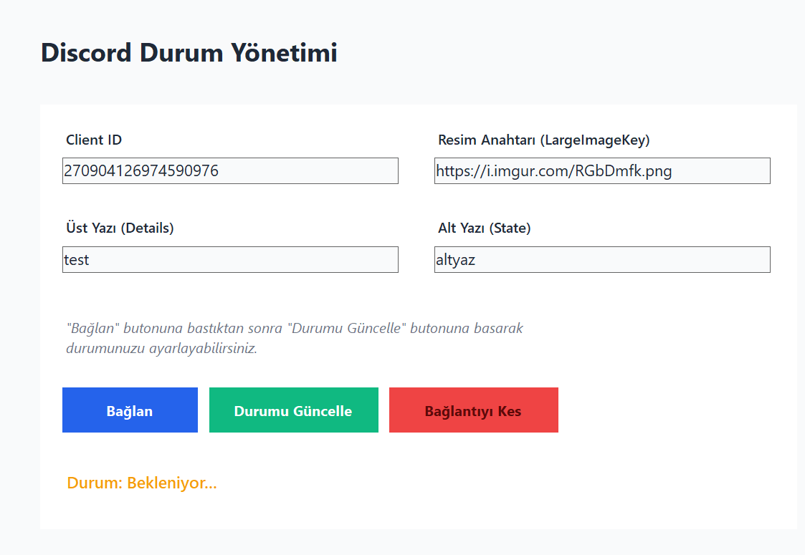
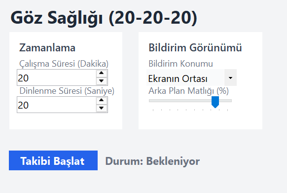
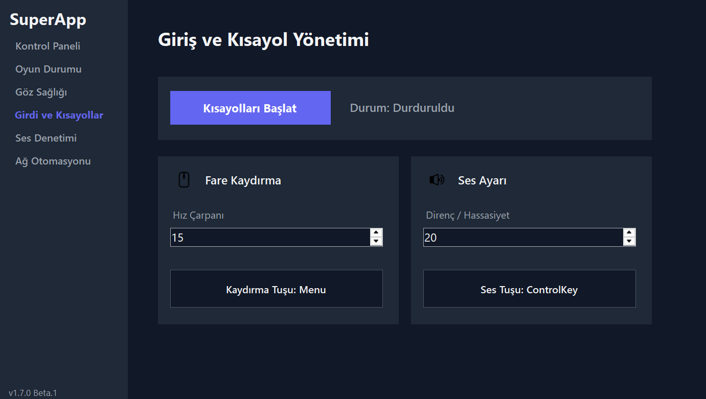
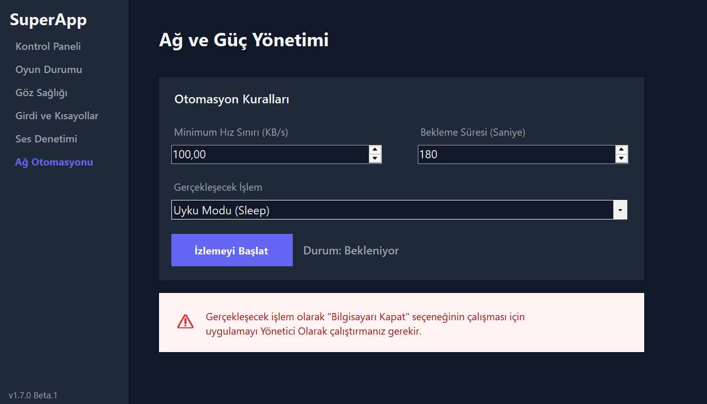

# SuperApp Hub 🚀


SuperApp Hub is a highly modular, performance-driven Windows desktop utility application built with C# and .NET 8.0. It provides a suite of advanced system management tools, utilizing custom-built native C libraries for low-level system hooks and optimized resource consumption.
## 🌍 Language Support

The current User Interface (UI) of the application is in **Turkish**. However, the entire codebase, architectural documentation, and API references are maintained in **English** to comply with global engineering standards. Multi-language support (Localization) is planned for future releases.
## ✨ Features

The application is built on a plug-in architecture. Each feature operates as an independent module:

*   **💬 Discord Presence Manager:** Fully customize your Discord Rich Presence. Set your Client ID, large image keys, details, and state to display exactly what you want on your profile.
*   **👁️ Eye Care (20-20-20 Rule):** Protect your vision during long coding or gaming sessions. Customize work/rest intervals, notification positioning, and background opacity to ensure you take necessary screen breaks.
*   **⌨️ Input & Shortcut Master:** Advanced mouse and keyboard mapping. Hold a designated key and move your mouse horizontally to adjust the volume, or vertically to simulate scroll wheel movements. Powered by high-performance native C hooks.
*   **🎙️ Mic Controller:** Take absolute control of your privacy. Assign a global hotkey (e.g., 'N') to instantly toggle your microphone mute status across the entire operating system. *(Push-to-Talk mode coming soon).*
*   **⚡ Network & Power Automation:** Smart power management based on network activity. Automatically puts the computer to sleep or shuts it down if the network download speed drops below a specific threshold (e.g., 100 KB/s) for a set duration. Perfect for leaving large downloads running overnight.

## 🏗️ Architecture & Modularity

SuperApp Hub strictly follows the **Open/Closed Principle (SOLID)** and a modular design pattern.

*   **Core App (`SmartApp`):** The main interface and module manager. It dynamically loads modules into memory at runtime without hardcoded dependencies.
*   **Modules (`SuperApp.Modules.*`):** Independent C# Class Libraries (`.dll`). They contain the UI (`UserControl`) and specific business logic.
*   **Native Libraries (`NativeLibs`):** Performance-critical operations (system hooks, input tracking) are written in **C** and encapsulated within their respective module's `NativeLibs` folder. *(Note: The source code for these C libraries is planned to be open-sourced and published in a separate repository in the near future).*

### Project Directory

```text📦 **SuperAppHub**
┣ 📂 `SmartApp` (Core UI & Module Manager)
┣ 📂 `SuperApp.Core` (Shared Interfaces e.g., IAppModule)
┣ 📂 `SuperApp.Modules.DiscordRPC`
┃ ┗ 📂 `NativeLibs`
┣ 📂 `SuperApp.Modules.EyeCare`
┃ ┗ 📂 `NativeLibs`
┣ 📂 `SuperApp.Modules.InputMaster`
┃ ┗ 📂 `NativeLibs`
┣ 📂 `SuperApp.Modules.MicController`
┃ ┗ 📂 `NativeLibs`
┗ 📂 `SuperApp.Modules.NetworkPower`
┃ ┗ 📂 `NativeLibs`
```

### Build Automation
The project utilizes advanced `MSBuild` configurations. Upon compilation:
1. Native C DLLs inside each module are automatically copied to the main output directory.
2. Module DLLs are automatically routed to the `Modules` folder.
   The Core app then dynamically discovers and injects these modules at launch.

## 🛠️ How to Create Your Own Module

SuperApp Hub is highly extensible. Developers can easily build and integrate custom modules without modifying the core application.

1. Create a new C# Class Library (`.dll`) project.
2. Add a reference to the `SuperApp.Core` project.
3. Implement the `IAppModule` interface in your main class.
4. Set your project's `OutputPath` to the main app's `Modules` directory.

On the next launch, the Module Manager will automatically detect, instantiate, and display your custom UI in the sidebar!

## 🔒 Privacy & Security

SuperApp Hub utilizes global system hooks (via native C libraries) to manage shortcuts, mouse inputs, and hardware states. We take your privacy seriously:

*   **100% Local Execution:** All data processing, input tracking, and network speed monitoring are done entirely on your local machine.
*   **Zero Telemetry:** The application **does not** collect, store, or transmit any personal data, keystrokes, or network packets to any external servers.
*   **Transparency:** The modular design ensures that you only load the features you trust and need.

## 🚀 Getting Started

### Prerequisites
*   [.NET 8.0 Desktop Runtime](https://dotnet.microsoft.com/download/dotnet/8.0)
*   Windows 10 / 11

### Installation & Build
1. Clone the repository:

   git clone https://github.com/baris-droid/SuperAppHub.git

2. Open the solution (`.sln`) in Visual Studio or JetBrains Rider.
3. Build the solution (`Ctrl + Shift + B`).
4. Run the `SmartApp` executable.
   *(Note: To use the "Shutdown" feature in Network Automation, the app must be run as Administrator).*

## 📸 Screenshots

|                                  Discord Manager                                  |                              Eye Care                               |
|:---------------------------------------------------------------------------------:|:-------------------------------------------------------------------:|
|  |  |

|                                 Input Management                                 |                                 Network & Power                                 |
|:--------------------------------------------------------------------------------:|:-------------------------------------------------------------------------------:|
|  |  |

## 🗺️ Roadmap
**Current Status:** `v1.7.0-beta.2`

The SuperApp Hub is under active development. Here are the planned features and milestones:

- [ ] **Open-Source Native Libraries:** Publish the source code of the performance-critical C libraries in a separate, dedicated repository.
- [ ] **Advanced Mic Controller:** Implement "Push-to-Talk" (PTT) functionality using global system hooks.
- [ ] **New Utility Modules:** Continuously expand the ecosystem with new quality-of-life modules.
- [ ] **UI/UX Enhancements:** Introduce customizable UI themes.
- [ ] **CI/CD Pipeline:** Automate the build, testing, and release process using GitHub Actions.

## 📜 License

This project is licensed under the MIT License - see the [LICENSE](LICENSE) file for details.
